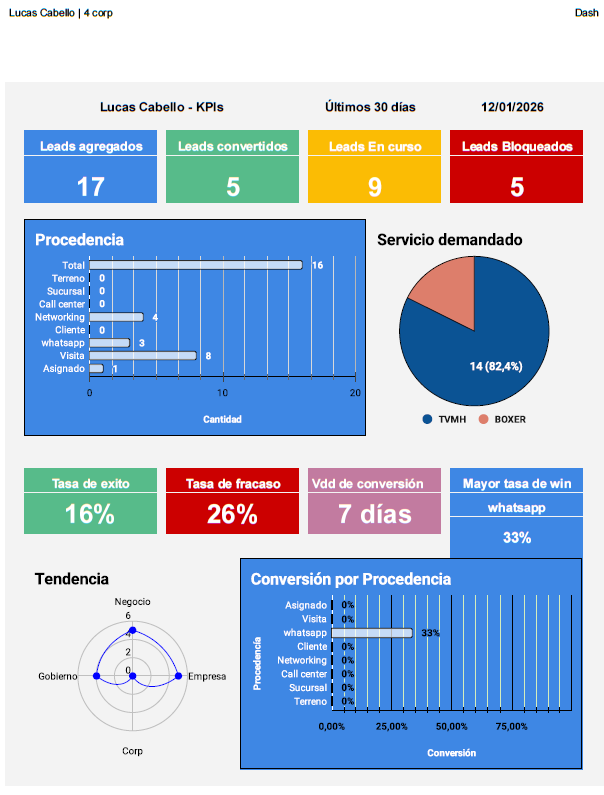

# Sales Operations & Business Automation Suite 🚀

This repository contains a collection of automation tools and scripts developed to optimize the **B2B Sales Cycle** and **CRM Management** for a telecommunications provider.

**Role:** Sales Operations Analyst / Developer
**Focus:** Process Automation, Data Integrity, Geospatial Analysis.

---

## 🛠️ Key Features

### 1. Automated Call Scheduling (Google Apps Script)
**Problem:** Manual data entry from leads sheets to Google Calendar was time-consuming and prone to errors.
**Solution:** Developed a script that parses lead data from Google Sheets, validates date/time formats, and automatically creates calendar events with formatted descriptions.
**Impact:** Reduced scheduling time by approx. 40% and improved follow-up consistency.

📄 **File:** [`agendar_llamada.js`](./agendar_llamada.js)

### 2. WhatsApp Proposal Generator
**Problem:** Drafting personalized B2B proposals for "Tech Refresh" vs. "Plan Upgrade" manually was inefficient.
**Solution:** Created a script that extracts client data, provides a UI prompt to select the proposal type, and generates a pre-written professional message.

📄 **File:** [`whatsapp_b2b_generator.js`](./whatsapp_b2b_generator.js)

---

## 📊 Visuals & Data Analysis

### CRM Dashboard & Tracking
*Custom Google Sheets CRM implementation to track 1,000+ corporate leads.*

*(Note: Sensitive client data has been obscured for privacy)*

### Geospatial Intelligence (QGIS)
*Custom coverage maps created to identify B2B prospects within Fiber Optic zones.*

---

## 💻 Tech Stack
* **Languages:** JavaScript (Google Apps Script)
* **Data:** Google Sheets (Advanced Formulas, Query), JSON
* **GIS:** QGIS (Geospatial Analysis)
* **Tools:** Zoho Invoice, PandaDoc

---

*Project developed by [Lucas Cabello]([https://www.linkedin.com/in/lucas-cabello](https://www.linkedin.com/in/lucas-cabello-477b71289/))*
