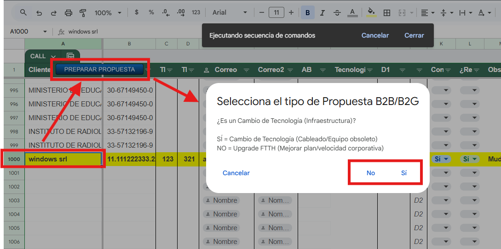
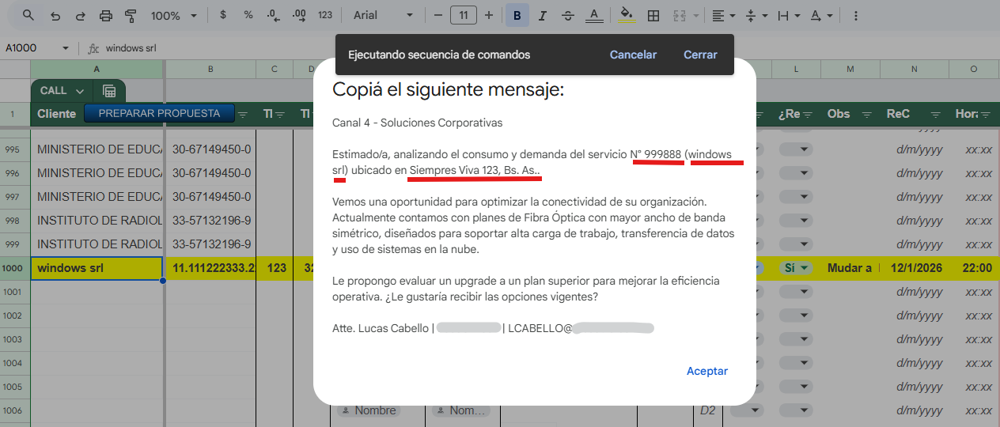
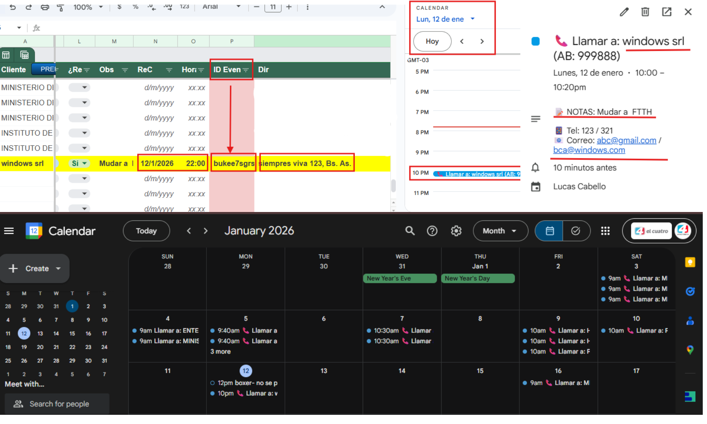
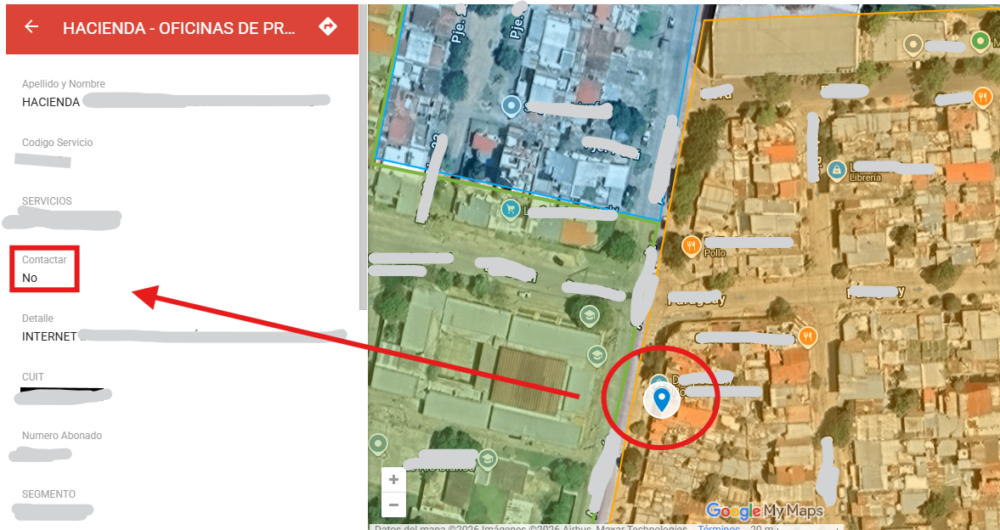
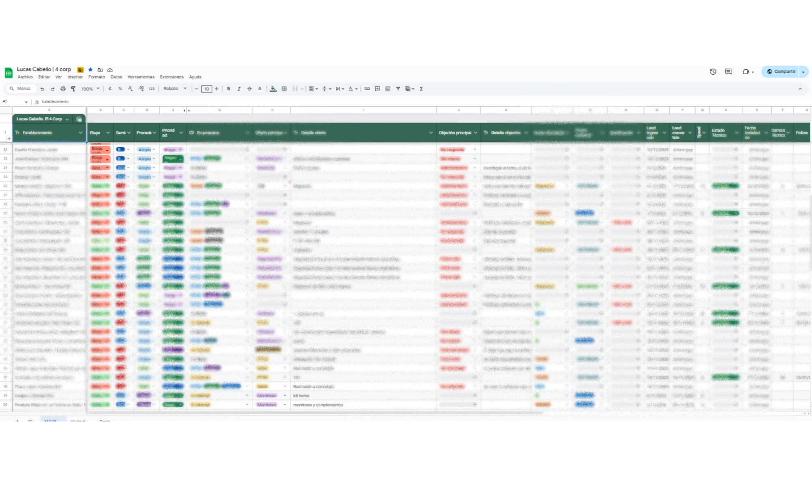
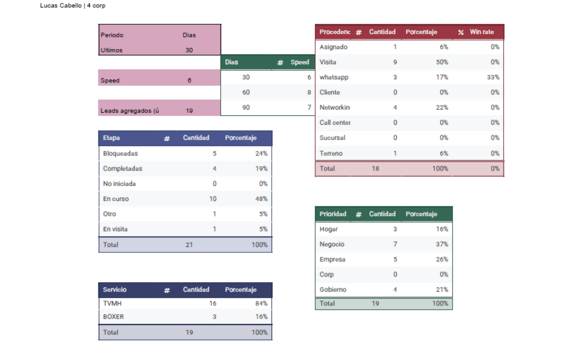
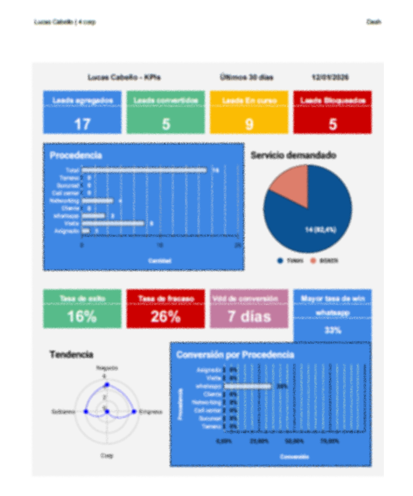

# Sales Operations & Business Automation Suite 🚀

This repository showcases a full-cycle B2B Sales Automation ecosystem. I designed and coded these tools to solve a critical lack of infrastructure in a telecommunications company, transforming manual data entry into an automated, data-driven workflow.

**Role:** Sales Operations Analyst / Developer
**Focus:** Process Automation, Advanced Data Modeling, Geospatial Analysis.

---

## 🚀 1. The "Command Center": Automated CRM & Workflow
**Context:** Managing a dataset of **1,000+ corporate clients** (Phone, Email, Tech Stack) required a dynamic solution, not just a static spreadsheet.

### Feature A: Intelligent Proposal Generator
Instead of manually typing messages, I built a custom UI button integrated into the sheet.
* **Logic:** The script reads the active row, analyzes the client's technology, and generates a tailored B2B proposal.
* **Visuals:** A custom menu button triggers a logic prompt to select the sales strategy.

### Feature B: Live Calendar Synchronization
Implemented a **CRUD (Create, Read, Update, Delete)** logic for scheduling:
* **Real-time Sync:** Typing a date in the "Meeting" column automatically books the Google Calendar slot with client details.
* **Smart Management:** If the date is changed, the event updates. If the date is deleted, the event is removed from the calendar automatically.

📄 **Source Code:** [`agendar_llamada.js`](./agendar_llamada.js), [`whatsapp_b2b_generator.js`](./whatsapp_b2b_generator.js)

---

## 🌍 2. Geospatial Intelligence (QGIS)
**Context:** Blindly calling clients is inefficient. I needed to know exactly which companies were within the Fiber Optic coverage zone before making contact.

**The Solution:**
I built a custom project in **QGIS** to visualize the market territory.
* **Layering:** Overlaid the company's network node map with the address database of potential corporate clients.
* **Lead Qualification:** Visually filtered out unserviceable leads, focusing efforts only on "connectable" high-value prospects.
* **Privacy & Security:** *Data shown in the visualization below has been sanitized/masked to protect client confidentiality.*

---

## 📊 3. Automated Reporting & Analytics
**The Context:** Raw data is useless without interpretation. The CRM accumulates thousands of scattered data points daily.

**The Data Pipeline:**
I designed a 3-stage visualization process within Google Sheets to turn noise into insights.

**Step 1: Raw Data Collection**
Aggregated unstructured input from sales calls, tech logs, and client interactions.

**Step 2: Structured Processing**
Used complex formulas (`QUERY`, `FILTER`, `ARRAYFORMULA`) to sanitize the data and group it into summary tables with percentages and hard numbers.

**Step 3: Executive Dashboard (KPIs)**
The final output. A visual command center that tracks performance in real-time, allowing for data-driven decisions on sales strategy.

---

## 💻 Tech Stack
* **Languages:** JavaScript (Google Apps Script)
* **Data Engineering:** Google Sheets (Advanced Query/Logic), JSON processing.
* **GIS Tools:** QGIS (Vector analysis, Layering).
* **Integration:** Zoho Invoice, PandaDoc.

---
*Project developed by [Lucas Cabello]([https://www.linkedin.com/in/lucas-cabello](https://www.linkedin.com/in/lucas-cabello-477b71289/))*
